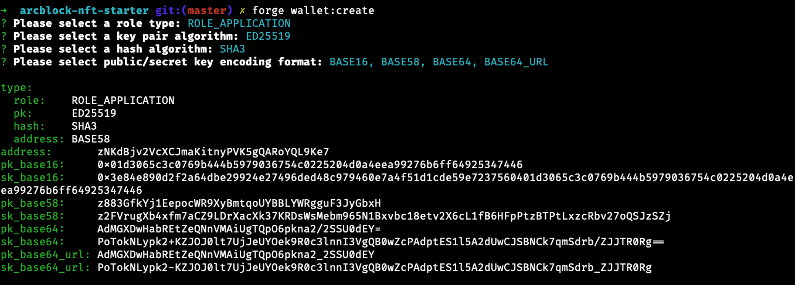

## ArcBlock NFT Starter

通过这个项目可以快速的实践：

1. NFT 的创建流程 (官方模板与自定义模板)
2. NFT 的发送流程
3. 基于 Atomic-Swap 的 NFT 创建，发送流程
4. NFT 持有证明
5. NFT VC 验证

### 如何使用

1. 克隆项目到本地

```
git clone https://github.com/ArcBlock/arcblock-nft-starter.git
```

2. 配置 `.env` 文件，在项目根目录下创建 `.env` 文件，并填入下方配置

```
# server only
MONGO_URI="mongodb://localhost/arcblock-nft-starter"
APP_TOKEN_SECRET="you_should_change_this(一串随机字符即可)"
APP_TOKEN_TTL="1d"
APP_SK="you_should_change_this"
APP_PORT=8000

# both server and client
REACT_APP_CHAIN_ID="playground"
REACT_APP_CHAIN_HOST="https://playground.network.arcblockio.cn/api"
REACT_APP_ASSET_CHAIN_ID="zinc-2019-05-17"
REACT_APP_ASSET_CHAIN_HOST="https://zinc.network.arcblockio.cn/api"
REACT_APP_APP_NAME="ArcBlock NFT Starter"
REACT_APP_APP_DESCRIPTION="One of the great use cases for decentralized identity and blockchain is around currency."
REACT_APP_APP_ID="you_should_change_this"
REACT_APP_BASE_URL="you_should_change_this"
REACT_APP_API_PREFIX=""
```

关于上面 `you_should_change_this` 相关的属性，可以通过 `forge cli` 获得：



3. 安装依赖

```
npm install
//or
yarn
```

4. 在链上注册账户

项目根目录下执行

```
node tools/declare.js
```

5. 本地启动 mongodb

6. 启动项目

```
yarn start
```

### 自定义 NFT 外观

本例子中 [util.js](https://github.com/ArcBlock/arcblock-nft-starter/blob/master/api/libs/util.js#L119) 里面我做了一个简单的自定义，自定义了一个 NFT 徽章，外观的展示由 `display` 属性决定，display 属性本质上是对一个标准的 svg 格式内容做了如下处理得到

1. gzip
2. toBase64

官方提供了 `@arcblock/nft-template` lib, 里面提供了 createTicketSvg 和
createCertSvg 两套通用模板，在 [playground](https://playground.wallet.arcblockio.cn/full) 中领取对应类型 NFT 即可看到效果。
